# 🩺 Pima Indians Diabetes - Sınıflandırma ve Özellik Analizi (Feature Engineering)

Bu projede, Pima Indians Diabetes veri setini kullanarak bireylerin diyabet hastası olup olmadığını tahmin eden güçlü sınıflandırma modelleri geliştirdim. Süreci sadece bir "kod çalıştırma" rutini olarak değil; hangi değişkenlerin model için hayati önem taşıdığını, hangilerinin ise arka planda sadece gürültü yarattığını incelediğim analitik bir dedektiflik çalışması olarak ele aldım. Amacım, ham verileri görselleştirme teknikleriyle işleyerek anlamlı içgörüler ortaya çıkarmaktır.

## 🛠 Kullanılan Teknolojiler ve Kütüphaneler
* **Python 3**
* **Pandas & NumPy** (Veri İşleme ve Manülasyon)
* **Scikit-Learn** (Model Eğitimi, Ölçeklendirme ve Metrikler)
* **Seaborn & Matplotlib** (Gelişmiş Veri Görselleştirme)

---

## 📊 Keşifçi Veri Analizi ve Veri Temizliği

### 0. Veri Ön İşleme ve Eksik Değer Yönetimi (Imputation)
Analize ve model eğitimine geçmeden önce, veri setinin kalitesini artırmak adına kritik bir ön işleme adımı uygulandı:
* **Gözlem:** Veri setindeki bazı örneklerde `Insulin`, `Glucose`, `BloodPressure` ve `BMI` gibi biyolojik olarak sıfır olamayacak değişkenlerin eksik veriler yüzünden `0` değerine sahip olduğu tespit edildi.
* **Aksiyon:** Bu hatalı/eksik sıfır değerleri veri setinden silmek yerine bilgi kaybını önlemek amacıyla **medyan (ortanca değer)** ile doldurularak (*Imputation*) veri seti arındırıldı.

### 1. Büyük Resim: Korelasyon Matrisi (Pusulamız)
Temizlenen veriler üzerinden tüm değişkenlerin birbiriyle olan ilişkisini makro düzeyde görebilmek için ısı haritası çıkardım[cite: 49].

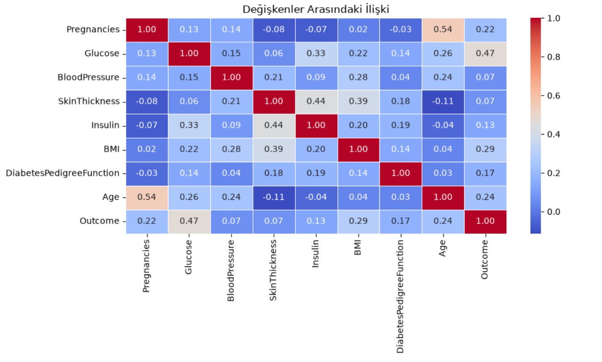
* **Analiz:** Matriste en dikkat çekici unsurlar; Hamilelik sayısı (`Pregnancies`) ile Yaş (`Age`) arasındaki güçlü pozitif yönlü bağ ($0.54$) ve Glikoz (`Glucose`) ile diyabet durumu (`Outcome`) arasındaki kritik ilişkidir ($0.47$)[cite: 49]. Bu matris, model optimizasyonunda hangi özelliklerin kilit rol oynayacağının sinyalini vermiştir.

---

### 2. Temel Risk Faktörleri ve Glikozun Gücü
Şeker oranının ve temel biyolojik faktörlerin diyabet (`Outcome`) üzerindeki etkisini çoklu grafik matrisiyle inceledim[cite: 47].

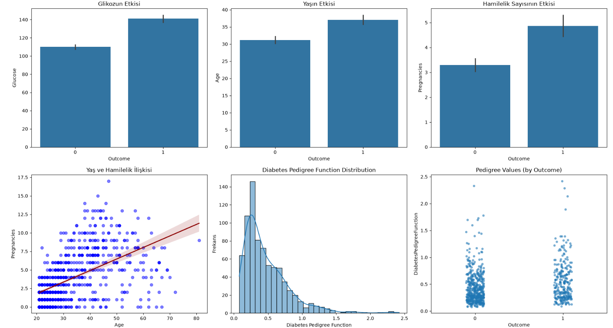
* **Bulgu:** Diyabet hastası olan bireylerin (`Outcome = 1`) ortalama glikoz, yaş ve hamilelik değerlerinin sağlıklı bireylere kıyasla daha yüksek seviyelerde seyrettiği açıkça görülmektedir[cite: 47].

---

### 3. Genetik Yatkınlık Faktörü (Diabetes Pedigree Function)
Aileden gelen genetik diyabet risk skorunun (`DiabetesPedigreeFunction`) sınıflar üzerindeki dağılımını **Boxplot** grafiğiyle mercek altına aldım[cite: 48].

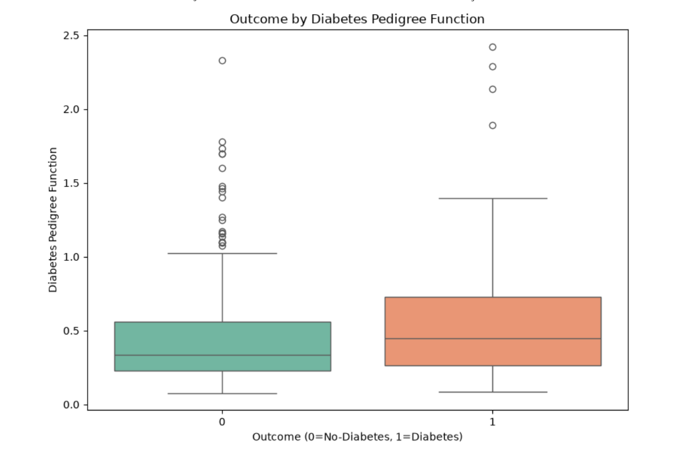
* **Bulgu:** Diyabet hastası olan bireylerin (`1`) genetik yatkınlık skorlarının medyan ve üst çeyrek dilimlerinin, sağlıklı bireylere (`0`) kıyasla daha yukarıda olduğu ve uç değerlerin (outliers) bu grupta yoğunlaştığı dikkat çekmektedir[cite: 48].

---

## ⚙️ Özellik Mühendisliği ve Gürültü Tıraşlama (Feature Selection)

Model performansını maksimize etmek amacıyla özellik önem düzeylerini inceledik:

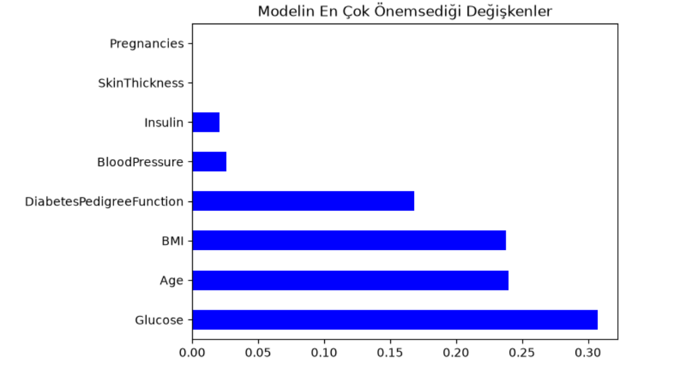

* **Öncesi ve Sonrası Optimizasyon:** Yapılan analizler sonucunda modele katkı sağlamayan bazı değişkenler elenerek özellik önem dağılımı güncellenmiştir.

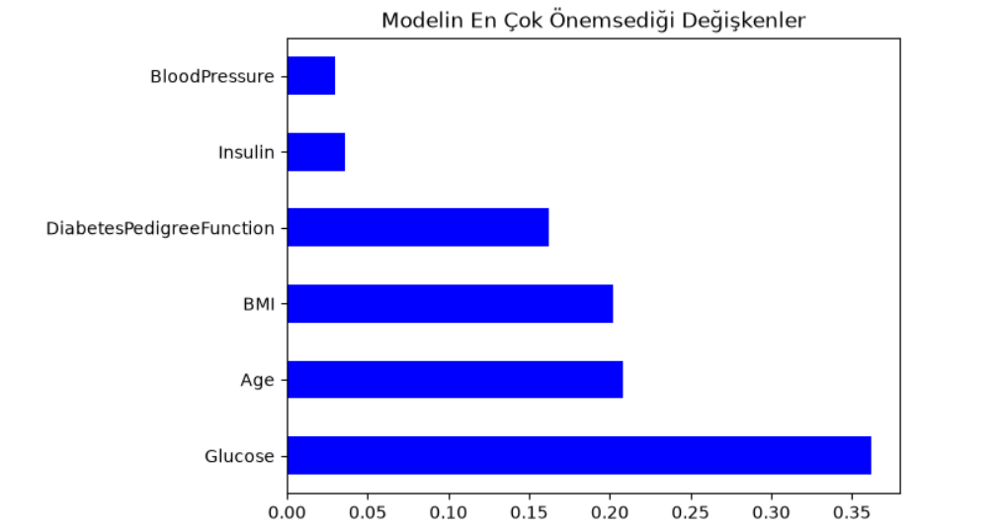
* **Bulgu:** Güncellenen grafikte de görüleceği üzere, tahmin gücünün büyük bir kısmı `Glucose`, `Age` ve `BMI` etrafında yoğunlaşmaktadır.

---

## 🤖 Model Kıyaslaması ve Performans Değerlendirmesi

Veri setindeki tüm modelleri test seti üzerinden koşturduğumuzda elde edilen başarım sonuçları[cite: 54]:

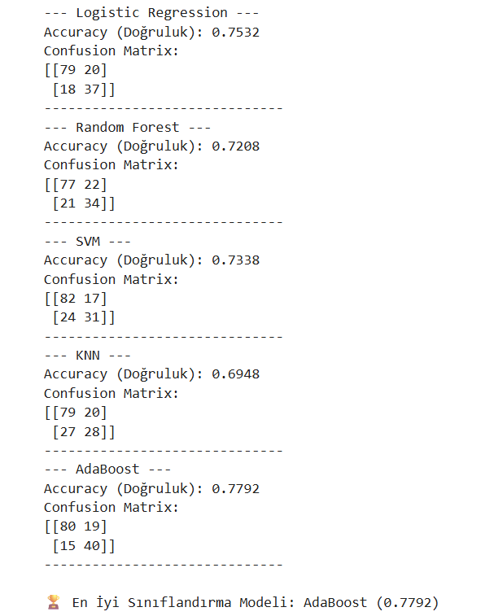

* **Özetle:** Denediğimiz tüm algoritmalar içinde en yüksek doğruluğu veren **AdaBoost**, %77.92'lik doğruluk oranıyla projenin kazanan modeli olmuştur.

---

## 🏆 ZİRVEDEKİ MODEL: Detaylı Hata Matrisleri ve Sınıflandırma Karneleri

Zirvedeki modelimizin detaylı başarı karnesi, hata matrisi (*Confusion Matrix*) ve ROC eğrisi analizi[cite: 50, 52]:

### 1. Model Sonuçları (AdaBoost / Öne Çıkan Model)
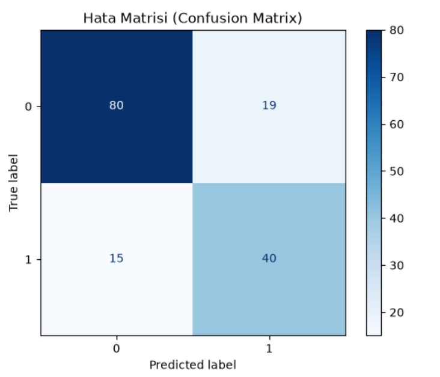
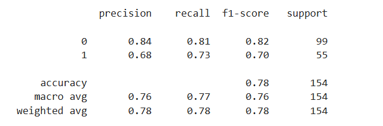
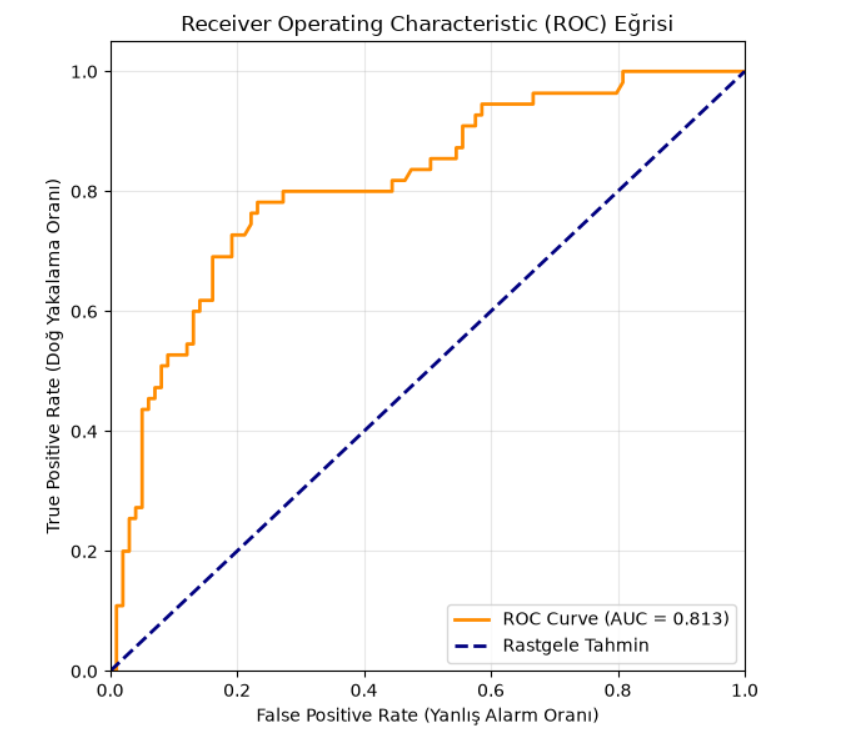
* **Değerlendirme:** Sağlıklı bireyleri (`0`) 80 doğru oranla yakalarken, diyabet hastalarını (`1`) 40 başarılı tahminle tespit etmiştir[cite: 50]. Weighted Average bazında **%78** doğruluk oranı yakalamıştır[cite: 52]. ROC eğrisi altında kalan alan **AUC = 0.813** olarak gerçekleşmiş ve modelin ayırt etme gücü tescillenmiştir.

### 2. Alternatif Model Sonuçları 
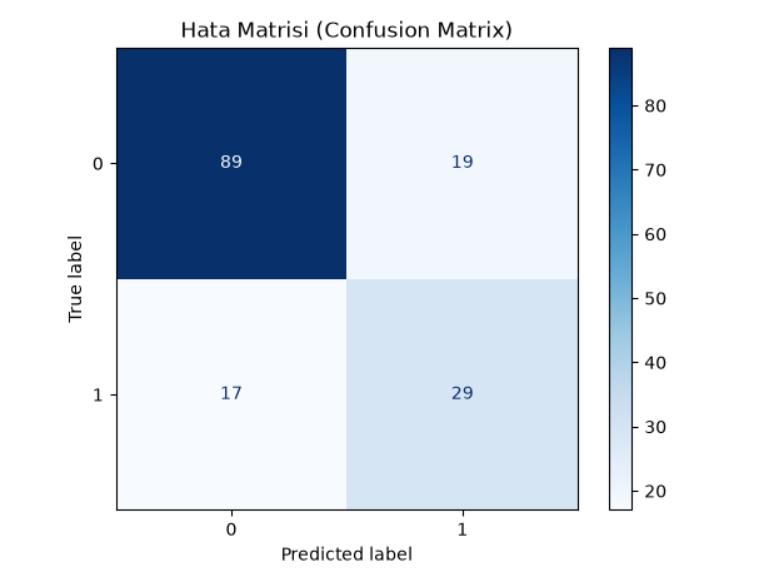
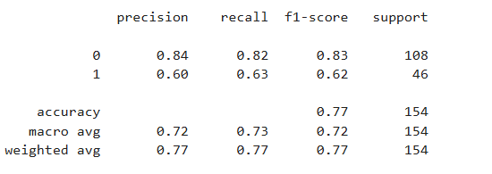
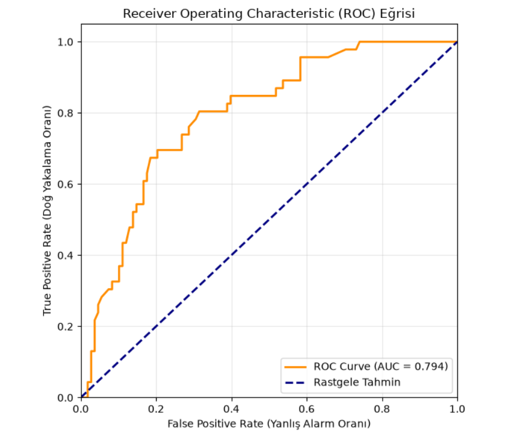
* **Değerlendirme:** Dengeli dağılım, `0.77` doğruluk oranı ve **AUC = 0.794** değerine sahip ROC eğrisiyle modelin genel kararlılığı desteklenmiştir[cite: 51, 53].

---

## 📂 Proje Yapısı ve Kullanım
* `pima_diabetes_analysis.ipynb`: Veri ön işleme, eksik değer doldurma, özellik eleme ve model eğitim adımlarının yer aldığı ana Jupyter Notebook dosyası.
* `Diabetes_prediction_datase.csv`: Analizde kullanılan ham veri seti.
* `README.md`: Projenin mimari özetini ve mühendislik kararlarını içeren rapor.
